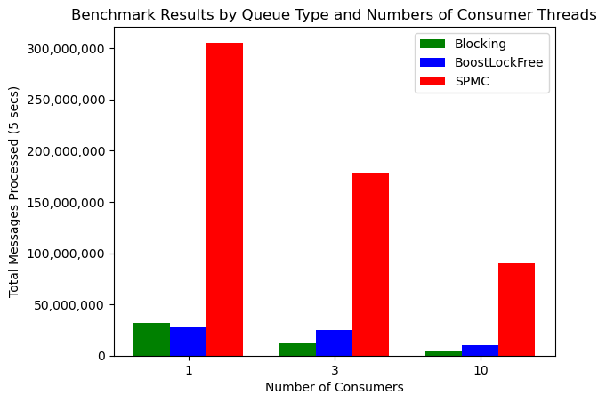

# ⚡️ Lock-Free Queues (SPSC & SPMC)

Inspired by a talk at CPPCon 2022: [Trading at Light Speed](https://youtu.be/8uAW5FQtcvE), I wanted to explore lock-free queue designs that avoid the overhead of mutexes while maintaining high performance and concurrency.

A **lock-free queue** eliminates costly locks and context switches by relying on **atomic operations**. These queues enable **fast message passing** between threads with minimal contention.

## 🚀 Why Lock-Free?
Using locks and mutexes introduces significant performance issues:
1. **Context switching overhead** when threads wait for locks.
2. **Increased contention** when multiple threads compete for the same resource.
3. **Poor cache efficiency**, as one thread might invalidate another's cache line.

Instead of locks, **atomic operations** and **versioning techniques** allow for efficient synchronization while ensuring correctness.

---

## 1️⃣ Single Producer Multiple Consumer (SPMC)
A **Single Producer Multiple Consumer (SPMC) queue** allows **one writer** to produce messages and **multiple consumers** to read them.

### 🔹 SPMC Version 1: Global Indices
As David Gross explains in *Trading at Light Speed*, the first version of an SPMC queue uses **two global atomic indices** to synchronize reads and writes.


While effective, this approach has **high contention** because all consumers and the producer update the same **global** indices.

### 🔹 SPMC Version 2: Localized Versioning ✅
A better approach is to **assign each queue element its own version number**. This reduces contention because:
1. **Consumers operate on separate elements**, reducing atomic operations on shared variables.
2. **Better cache locality**, since each consumer updates metadata close to the data it reads.

### 📌 How Synchronization Works in SPMC
1. **Writer increments the version before writing** to prevent consumers from accessing stale data.
2. **Consumers check the version**:
   - **Odd version** → Ready to read.
   - **Even version** → Being written or already read.
3. **After reading, the consumer increments the version** to allow others to read.

This technique **minimizes atomic contention**, making it significantly faster than global indices.

---

## 2️⃣ Single Producer Single Consumer (SPSC) ✅
A **Single Producer Single Consumer (SPSC) queue** ensures that each data block is read **exactly once** before being overwritten.

- Each block has an atomic flag `std::atomic<bool> unread` to track whether the data has been read.
- A writer must **ensure it does not overwrite unread data**.
- A reader consumes the data **exactly once**, then marks it as read.

### 🔹 Handling Race Conditions
A potential issue arises if a **writer starts overwriting** a block **before the reader has finished reading**. The solution:
1. **Writers set `unread` to false before writing** to prevent concurrent reads.
2. **Using `compare_exchange_strong`** ensures only one reader can consume the block.
3. **Checking `mVersion`**:
   - If `mVersion` is **odd**, a reader is reading → **do not overwrite**.
   - If `mVersion` is **even**, it's safe to write.

### 📌 Why This Works
- Prevents **data corruption** by ensuring readers do not access partially written blocks.
- Writers do not overwrite data that has **not been read yet**.
- Readers can safely consume each block **only once**.

This technique ensures **safe, efficient, and low-latency communication** between a producer and a single consumer.

---

## ⚙️ Queue Implementation
Each element in the queue maintains **its own version number**, reducing contention and improving cache locality.

```cpp
struct Block
{
    // Local block versions reduce contention for the queue
    std::atomic<BlockVersion> mVersion;
    // Size of the data
    std::atomic<MessageSize> mSize;
    // 64-byte buffer
    alignas(64) uint8_t mData[64];
};
```
## 🔄 Synchronization Overview

- **All block versions start at `0`** (no reads allowed).

### ✍️ Writing:
1. **First write**:
   - Write the data.
   - Increment the version to `1` (**odd → read allowed**).

2. **Rewriting**:
   - Increment the version (**even → no read allowed**).
   - Perform the write.
   - Increment the version again (**odd → read allowed**).

### 📖 Reading:
1. If the version is **odd**, read the data.
2. Increment the version by `2` (**ready for reuse**).

This method ensures **safe message passing** and **minimizes unnecessary atomic updates**.

**Note:** This design can be slightly modified to make the queue load balance messages instead of multicasting.

## 🔢 Performance Test
The SPMC Queue in `spmc_q.h` was tested for the number of messages processed by the consumers over 5 seconds with a blocking queue using mutexes and locks, and the `boost::lockfree::queue`.
This is not totally a fair comparison as the blocking queue and the `boost::lockfree::queue` are not multicast.


From the histogram above, you can see the SPMC Queue completely overtakes the other 2 queues.
**Note:** The numbers should be looked at relatively compared to the other queues as the specific performance is system and compiler dependent.

## 📝 Code
The code for SPMC Queue and all the benchmarking done is available in the `src` folder.
